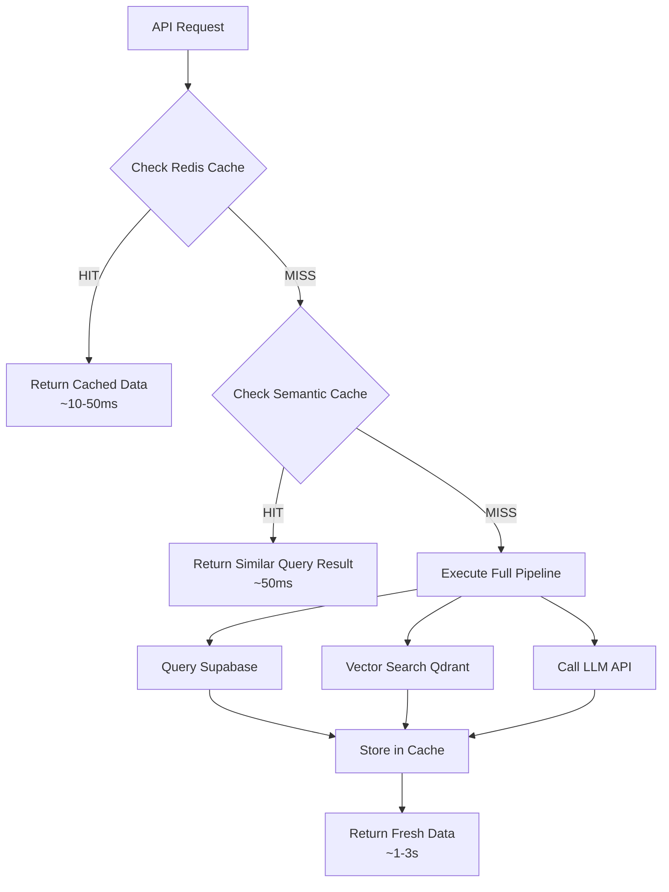
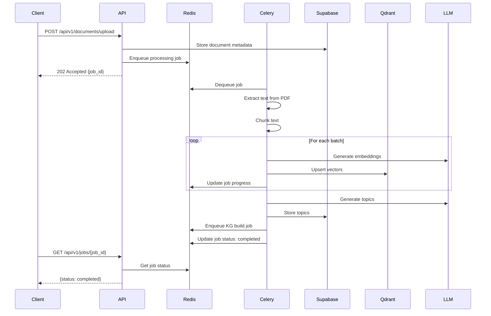
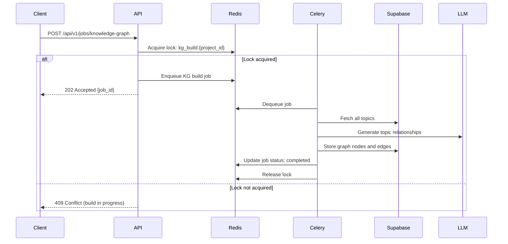
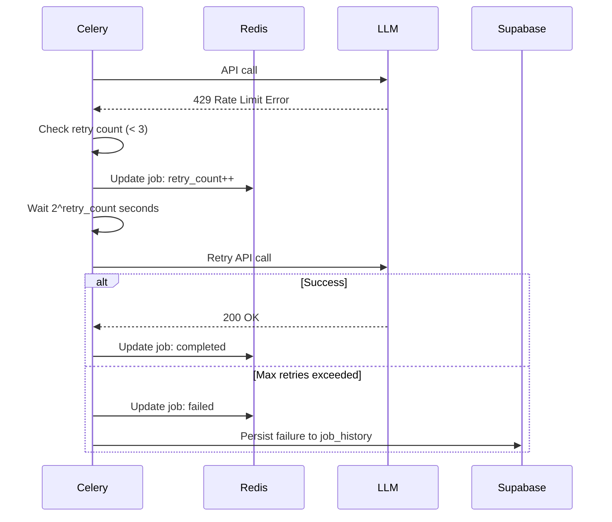
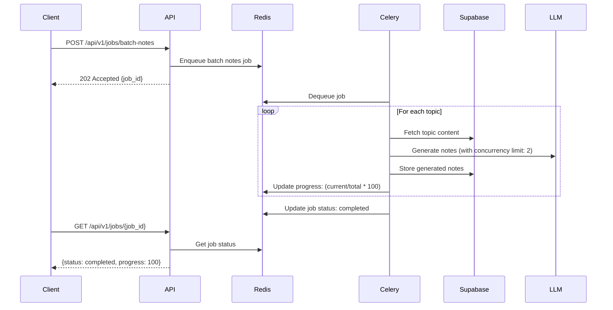

# Design Document: High-Performance Backend Refactoring

## Overview

This design document specifies the architecture for transforming the LuminaIQ backend into a high-performance, production-grade system optimized for Azure deployment. The refactoring introduces Redis-based caching, persistent background job processing with Celery/ARQ, horizontal scalability, and comprehensive observability through Azure Application Insights.

### Current Architecture

The existing system is a FastAPI-based backend that processes educational documents through a pipeline:
1. Document upload → text extraction → chunking → embedding generation
2. Topic extraction → knowledge graph generation
3. RAG-powered features: chat, quiz generation, notes, flashcards

Current limitations:
- No persistent caching (repeated queries hit expensive APIs)
- In-memory job queue (jobs lost on restart)
- Limited horizontal scalability (in-memory state)
- Basic observability (file-based logging only)
- No distributed coordination (race conditions possible)

### Target Architecture

The refactored system will support:
- 100+ concurrent users
- Sub-300ms API response times (with cache hits)
- 90%+ cache hit rates for repeated queries
- Zero data loss on restarts
- Horizontal scaling with multiple backend instances
- Production-grade monitoring and alerting

## Architecture

### System Architecture Diagram

```mermaid
graph TB
    subgraph "Client Layer"
        FE[Frontend React App]
    end
    
    subgraph "Load Balancer"
        LB[Azure Load Balancer<br/>Session Affinity]
    end
    
    subgraph "Application Layer"
        API1[FastAPI Instance 1<br/>Stateless]
        API2[FastAPI Instance 2<br/>Stateless]
        API3[FastAPI Instance N<br/>Auto-scaled]
    end
    
    subgraph "Background Workers"
        W1[Celery Worker 1<br/>Job Processing]
        W2[Celery Worker 2<br/>Job Processing]
        W3[Celery Worker N<br/>Auto-scaled]
    end
    
    subgraph "Cache & Queue Layer"
        REDIS[(Redis Cache<br/>- Session Store<br/>- Query Cache<br/>- Job Queue<br/>- Distributed Locks<br/>- Rate Limiter)]
    end
    
    subgraph "Data Layer"
        SUPABASE[(Supabase PostgreSQL<br/>- Documents<br/>- Users<br/>- Projects<br/>- Chat History)]
        QDRANT[(Qdrant Vector DB<br/>- Document Embeddings<br/>- Semantic Search)]
    end
    
    subgraph "External Services"
        AZURE_AI[Azure OpenAI<br/>- LLM<br/>- Chat Completion]
        EMBED_API[Embedding API<br/>- Text Embeddings]
        STORAGE[Azure Blob Storage<br/>- Document Files]
    end
    
    subgraph "Observability"
        APP_INSIGHTS[Azure Application Insights<br/>- Telemetry<br/>- Logs<br/>- Traces<br/>- Metrics]
    end
    
    FE -->|HTTPS| LB
    LB -->|Round Robin| API1
    LB -->|Round Robin| API2
    LB -->|Round Robin| API3
    
    API1 -->|Read/Write| REDIS
    API2 -->|Read/Write| REDIS
    API3 -->|Read/Write| REDIS
    
    API1 -->|Enqueue Jobs| REDIS
    API2 -->|Enqueue Jobs| REDIS
    API3 -->|Enqueue Jobs| REDIS
    
    W1 -->|Dequeue Jobs| REDIS
    W2 -->|Dequeue Jobs| REDIS
    W3 -->|Dequeue Jobs| REDIS
    
    API1 -->|Query| SUPABASE
    API2 -->|Query| SUPABASE
    API3 -->|Query| SUPABASE
    
    API1 -->|Vector Search| QDRANT
    API2 -->|Vector Search| QDRANT
    API3 -->|Vector Search| QDRANT
    
    W1 -->|Write| SUPABASE
    W2 -->|Write| SUPABASE
    W3 -->|Write| SUPABASE
    
    W1 -->|Upsert Vectors| QDRANT
    W2 -->|Upsert Vectors| QDRANT
    W3 -->|Upsert Vectors| QDRANT
    
    API1 -->|LLM Calls| AZURE_AI
    API2 -->|LLM Calls| AZURE_AI
    API3 -->|LLM Calls| AZURE_AI
    
    W1 -->|Generate Embeddings| EMBED_API
    W2 -->|Generate Embeddings| EMBED_API
    W3 -->|Generate Embeddings| EMBED_API
    
    API1 -->|Upload/Download| STORAGE
    API2 -->|Upload/Download| STORAGE
    API3 -->|Upload/Download| STORAGE
    
    API1 -->|Telemetry| APP_INSIGHTS
    API2 -->|Telemetry| APP_INSIGHTS
    API3 -->|Telemetry| APP_INSIGHTS
    W1 -->|Telemetry| APP_INSIGHTS
    W2 -->|Telemetry| APP_INSIGHTS
    W3 -->|Telemetry| APP_INSIGHTS
```



### Architecture Principles

1. **Stateless Application Tier**: All API instances are stateless, storing session and cache data in Redis
2. **Persistent Job Queue**: Background jobs survive restarts via Redis-backed queue
3. **Distributed Coordination**: Redis-based locks prevent race conditions across instances
4. **Cache-First Strategy**: Check cache before expensive operations (DB, API calls)
5. **Graceful Degradation**: System continues operating when Redis is unavailable
6. **Observability-First**: All operations emit telemetry for monitoring and debugging

## Components and Interfaces

### 1. Redis Cache Manager

**Purpose**: Centralized Redis connection management with connection pooling and automatic reconnection.

**Interface**:
```python
class RedisCacheManager:
    def __init__(self, host: str, port: int, password: str, db: int, max_connections: int = 50)
    async def connect() -> None
    async def disconnect() -> None
    async def get(key: str) -> Optional[str]
    async def set(key: str, value: str, ttl: Optional[int] = None) -> bool
    async def delete(key: str) -> bool
    async def exists(key: str) -> bool
    async def get_many(keys: List[str]) -> Dict[str, str]
    async def set_many(items: Dict[str, str], ttl: Optional[int] = None) -> bool
    async def increment(key: str, amount: int = 1) -> int
    async def expire(key: str, ttl: int) -> bool
    def get_stats() -> Dict[str, Any]  # hit rate, miss rate, total keys
```

**Key Namespacing Strategy**:
- `emb:{text_hash}` - Embedding cache
- `query:{query_hash}` - Semantic query cache
- `vsearch:{collection}:{vector_hash}:{filter_hash}` - Vector search results
- `doc:{doc_id}` - Document metadata
- `session:{session_id}` - User session data
- `ratelimit:{user_id}:{endpoint}` - Rate limiting counters
- `lock:{resource_id}` - Distributed locks
- `job:{job_id}` - Background job status

**Connection Pooling**:
- Min connections: 10
- Max connections: 50
- Connection timeout: 5 seconds
- Socket keepalive: enabled
- Retry on connection failure: 3 attempts with exponential backoff

**Graceful Degradation**:
- On Redis unavailable: log warning, return None for get operations
- Continue serving requests from database
- Disable background job enqueuing (process synchronously)
- Auto-reconnect when Redis becomes available

### 2. Semantic Cache Service

**Purpose**: Cache LLM responses indexed by semantic similarity to avoid redundant API calls.

**Interface**:
```python
class SemanticCacheService:
    def __init__(self, redis_manager: RedisCacheManager, embedding_service: EmbeddingService)
    async def get_cached_response(query: str, similarity_threshold: float = 0.95) -> Optional[CachedResponse]
    async def cache_response(query: str, answer: str, sources: List[Dict]) -> None
    async def invalidate_project_cache(project_id: str) -> None
    def get_hit_rate() -> float
```

**Data Structure**:
```python
@dataclass
class CachedResponse:
    query: str
    query_embedding: List[float]
    answer: str
    sources: List[Dict]
    cached_at: datetime
    hit_count: int
```

**Storage Strategy**:
- Store query embeddings in Redis sorted set for similarity search
- Use cosine similarity for matching (threshold: 0.95)
- TTL: 7 days
- Include cache metadata in API responses: `X-Cache-Status: HIT|MISS`

**Similarity Search Algorithm**:
1. Generate embedding for incoming query
2. Search Redis sorted set for embeddings with cosine similarity > 0.95
3. If match found, return cached answer
4. If no match, execute RAG pipeline and cache result

### 3. Background Job System

**Purpose**: Persistent, distributed job queue for long-running operations.

**Technology Choice**: Celery with Redis broker (preferred) or ARQ as lightweight alternative.

**Interface**:
```python
class BackgroundJobManager:
    def __init__(self, redis_url: str)
    async def enqueue_job(job_type: JobType, payload: Dict, priority: int = 0) -> str  # returns job_id
    async def get_job_status(job_id: str) -> JobStatus
    async def get_project_jobs(project_id: str) -> List[JobStatus]
    async def retry_failed_job(job_id: str) -> bool
    async def cancel_job(job_id: str) -> bool
```

**Job Types**:
- `KNOWLEDGE_GRAPH_BUILD`: Generate knowledge graph from topics
- `BATCH_NOTES_GENERATION`: Generate notes for multiple topics
- `DOCUMENT_REPROCESSING`: Reprocess document embeddings
- `CACHE_WARMING`: Preload frequently accessed data

**Job Status Schema**:
```python
@dataclass
class JobStatus:
    job_id: str
    job_type: JobType
    status: Literal["pending", "processing", "completed", "failed"]
    progress: int  # 0-100
    project_id: str
    created_at: datetime
    started_at: Optional[datetime]
    completed_at: Optional[datetime]
    error_message: Optional[str]
    retry_count: int
    result: Optional[Dict]  # Job-specific result data
```

**Retry Logic**:
- Max retries: 3
- Backoff delays: [2s, 4s, 8s]
- Retry on: network errors, rate limits, transient failures
- No retry on: validation errors, authentication failures

**Concurrency Limits**:
- Max concurrent workers: 3 (configurable via `CELERY_WORKER_CONCURRENCY`)
- Max LLM calls per worker: 2 (to avoid rate limits)
- Job timeout: 10 minutes

### 4. Distributed Lock Manager

**Purpose**: Prevent race conditions for exclusive operations across multiple instances.

**Interface**:
```python
class DistributedLockManager:
    def __init__(self, redis_manager: RedisCacheManager)
    async def acquire_lock(resource_id: str, timeout: int = 5, ttl: int = 300) -> Optional[str]  # returns lock_token
    async def release_lock(resource_id: str, lock_token: str) -> bool
    async def extend_lock(resource_id: str, lock_token: str, ttl: int = 300) -> bool
    @contextmanager
    async def lock(resource_id: str, timeout: int = 5, ttl: int = 300)
```

**Usage Example**:
```python
async with lock_manager.lock(f"kg_build:{project_id}"):
    # Only one instance can build knowledge graph at a time
    await knowledge_graph.build_graph_from_topics(project_id, topics)
```

**Lock Implementation**:
- Redis SET with NX (only set if not exists) and EX (expiration)
- Lock token: UUID to prevent accidental release by other processes
- Auto-expiration: 5 minutes (prevents deadlocks from crashed processes)
- Acquire timeout: 5 seconds (fail fast if lock unavailable)

**Protected Operations**:
- Knowledge graph building
- Document reprocessing
- Cache warming
- Batch operations on same resource

### 5. Session Manager

**Purpose**: Fast, distributed session storage for chat history and user state.

**Interface**:
```python
class SessionManager:
    def __init__(self, redis_manager: RedisCacheManager)
    async def create_session(user_id: str, project_id: str) -> str  # returns session_id
    async def get_session(session_id: str) -> Optional[Session]
    async def add_message(session_id: str, message: ChatMessage) -> None
    async def get_chat_history(session_id: str, limit: int = 50) -> List[ChatMessage]
    async def persist_session(session_id: str) -> None  # Save to Supabase
    async def delete_session(session_id: str) -> None
```

**Session Data Structure**:
```python
@dataclass
class Session:
    session_id: str
    user_id: str
    project_id: str
    messages: List[ChatMessage]  # Last 50 messages
    created_at: datetime
    last_activity: datetime
    metadata: Dict[str, Any]
```

**Storage Strategy**:
- Store in Redis as JSON with TTL of 24 hours
- Keep last 50 messages per session in memory
- Persist to Supabase on session expiration or explicit save
- Use Redis list for efficient message append and retrieval

**Session Migration**:
- Sessions stored in Redis are accessible from any backend instance
- Load balancer uses sticky sessions for WebSocket/SSE connections
- Session data includes correlation ID for request tracing

### 6. Rate Limiter

**Purpose**: Distributed rate limiting across multiple backend instances.

**Interface**:
```python
class RateLimiter:
    def __init__(self, redis_manager: RedisCacheManager)
    async def check_rate_limit(user_id: str, endpoint: str, limit: int, window: int) -> RateLimitResult
    async def increment(user_id: str, endpoint: str) -> int
    async def reset(user_id: str, endpoint: str) -> None
```

**Rate Limit Configuration**:
- Read endpoints: 100 requests/minute
- Write endpoints: 50 requests/minute
- LLM endpoints: 20 requests/minute
- Upload endpoints: 10 requests/minute

**Algorithm**: Sliding window with Redis sorted sets
1. Add current timestamp to sorted set for user+endpoint
2. Remove timestamps older than window
3. Count remaining timestamps
4. Allow if count < limit

**Response Headers**:
- `X-RateLimit-Limit`: Maximum requests allowed
- `X-RateLimit-Remaining`: Requests remaining in window
- `X-RateLimit-Reset`: Timestamp when limit resets
- `Retry-After`: Seconds to wait (on 429 response)

### 7. Health Check System

**Purpose**: Provide health and readiness endpoints for load balancer probes.

**Interface**:
```python
class HealthCheckService:
    def __init__(self, redis_manager: RedisCacheManager, supabase_client: Client, qdrant_client: QdrantClient)
    async def check_health() -> HealthStatus
    async def check_readiness() -> ReadinessStatus
    async def check_dependency(name: str) -> DependencyStatus
```

**Health Endpoint** (`GET /health`):
- Returns 200 OK if service is running
- Response time: < 100ms
- No dependency checks

**Readiness Endpoint** (`GET /health/ready`):
- Returns 200 OK if all dependencies are healthy
- Returns 503 Service Unavailable if any dependency is down
- Checks: Redis, Supabase, Qdrant, Azure OpenAI
- Response time: < 1 second
- Response body includes dependency status details

**Dependency Status**:
```python
@dataclass
class DependencyStatus:
    name: str
    status: Literal["healthy", "degraded", "unhealthy"]
    latency_ms: float
    error_message: Optional[str]
```

### 8. Telemetry Integration

**Purpose**: Comprehensive observability through Azure Application Insights.

**Components**:
- Request telemetry (duration, status, endpoint)
- Exception telemetry (stack traces, context)
- Dependency telemetry (Redis, Supabase, Qdrant, LLM API)
- Custom metrics (cache hit rate, job queue length, embedding throughput)
- Distributed tracing (OpenTelemetry)

**Interface**:
```python
class TelemetryService:
    def __init__(self, connection_string: str)
    def track_request(name: str, duration: float, status_code: int, properties: Dict)
    def track_exception(exception: Exception, properties: Dict)
    def track_dependency(name: str, type: str, duration: float, success: bool, properties: Dict)
    def track_metric(name: str, value: float, properties: Dict)
    def track_event(name: str, properties: Dict)
    def start_span(operation_name: str) -> Span
```

**Correlation ID Propagation**:
- Generate unique correlation ID for each request
- Include in all log entries: `{"correlation_id": "...", "message": "..."}`
- Include in response headers: `X-Correlation-ID`
- Propagate to background jobs
- Link all telemetry with correlation ID

**Custom Metrics**:
- `cache.hit_rate`: Percentage of cache hits
- `cache.embedding.hit_rate`: Embedding cache hit rate
- `cache.query.hit_rate`: Semantic query cache hit rate
- `job.queue_length`: Number of pending jobs
- `job.processing_time`: Average job processing time
- `embedding.throughput`: Embeddings generated per second
- `api.response_time.p95`: 95th percentile response time


## Data Models

### Redis Data Structures

#### 1. Embedding Cache
```
Key: emb:{sha256(text)}
Type: String (JSON)
TTL: 30 days
Value: {
  "text_hash": "abc123...",
  "embedding": [0.123, 0.456, ...],
  "model": "text-embedding-3-small",
  "created_at": "2024-01-15T10:30:00Z"
}
```

#### 2. Semantic Query Cache
```
Key: query:{project_id}:{sha256(query)}
Type: String (JSON)
TTL: 7 days
Value: {
  "query": "What is photosynthesis?",
  "query_embedding": [0.123, ...],
  "answer": "Photosynthesis is...",
  "sources": [{"doc_id": "...", "doc_name": "...", "chunk_text": "..."}],
  "cached_at": "2024-01-15T10:30:00Z",
  "hit_count": 5
}

Index: query_embeddings:{project_id}
Type: Sorted Set
Score: timestamp
Member: query_hash
```

#### 3. Vector Search Cache
```
Key: vsearch:{collection}:{vector_hash}:{filter_hash}
Type: String (JSON)
TTL: 1 hour
Value: {
  "results": [
    {"id": "...", "score": 0.95, "payload": {...}},
    ...
  ],
  "cached_at": "2024-01-15T10:30:00Z"
}
```

#### 4. Document Metadata Cache
```
Key: doc:{doc_id}
Type: String (JSON)
TTL: 6 hours
Value: {
  "id": "doc_123",
  "filename": "biology_chapter1.pdf",
  "project_id": "proj_456",
  "topics": ["photosynthesis", "cellular respiration"],
  "upload_status": "completed",
  "created_at": "2024-01-15T10:00:00Z"
}

Key: docs:{project_id}
Type: Set
TTL: 6 hours
Members: [doc_id1, doc_id2, ...]
```

#### 5. Session Storage
```
Key: session:{session_id}
Type: String (JSON)
TTL: 24 hours
Value: {
  "session_id": "sess_789",
  "user_id": "user_123",
  "project_id": "proj_456",
  "created_at": "2024-01-15T09:00:00Z",
  "last_activity": "2024-01-15T10:30:00Z"
}

Key: session:{session_id}:messages
Type: List
TTL: 24 hours
Members: [
  {"role": "user", "content": "...", "timestamp": "..."},
  {"role": "assistant", "content": "...", "timestamp": "..."}
]
```

#### 6. Rate Limiting
```
Key: ratelimit:{user_id}:{endpoint}
Type: Sorted Set
TTL: 60 seconds (window size)
Score: timestamp (milliseconds)
Members: request_id
```

#### 7. Distributed Locks
```
Key: lock:{resource_id}
Type: String
TTL: 300 seconds (5 minutes)
Value: {lock_token} (UUID)
```

#### 8. Background Jobs
```
Key: job:{job_id}
Type: String (JSON)
TTL: 24 hours
Value: {
  "job_id": "job_123",
  "job_type": "KNOWLEDGE_GRAPH_BUILD",
  "status": "processing",
  "progress": 45,
  "project_id": "proj_456",
  "created_at": "2024-01-15T10:00:00Z",
  "started_at": "2024-01-15T10:01:00Z",
  "error_message": null,
  "retry_count": 0,
  "payload": {...}
}

Key: jobs:{project_id}
Type: Set
TTL: 24 hours
Members: [job_id1, job_id2, ...]
```

### Supabase Database Schema Extensions

#### Job History Table
```sql
CREATE TABLE job_history (
  id UUID PRIMARY KEY DEFAULT uuid_generate_v4(),
  job_id VARCHAR(255) UNIQUE NOT NULL,
  job_type VARCHAR(50) NOT NULL,
  status VARCHAR(20) NOT NULL,
  project_id UUID REFERENCES projects(id) ON DELETE CASCADE,
  user_id UUID REFERENCES users(id) ON DELETE SET NULL,
  created_at TIMESTAMP WITH TIME ZONE DEFAULT NOW(),
  started_at TIMESTAMP WITH TIME ZONE,
  completed_at TIMESTAMP WITH TIME ZONE,
  error_message TEXT,
  retry_count INTEGER DEFAULT 0,
  result JSONB,
  INDEX idx_job_history_project (project_id, created_at DESC),
  INDEX idx_job_history_status (status, created_at DESC)
);
```

#### Cache Statistics Table
```sql
CREATE TABLE cache_statistics (
  id UUID PRIMARY KEY DEFAULT uuid_generate_v4(),
  metric_name VARCHAR(100) NOT NULL,
  metric_value FLOAT NOT NULL,
  recorded_at TIMESTAMP WITH TIME ZONE DEFAULT NOW(),
  metadata JSONB,
  INDEX idx_cache_stats_metric (metric_name, recorded_at DESC)
);
```

### Celery Task Schemas

#### Knowledge Graph Build Task
```python
@celery_app.task(bind=True, max_retries=3)
def build_knowledge_graph(self, project_id: str, topics: List[str], force_rebuild: bool = False):
    """
    Build knowledge graph from topics.
    
    Args:
        project_id: Project identifier
        topics: List of topic names
        force_rebuild: Whether to rebuild existing graph
    
    Returns:
        Dict with graph statistics
    """
    pass
```

#### Batch Notes Generation Task
```python
@celery_app.task(bind=True, max_retries=3)
def generate_batch_notes(self, project_id: str, topic_ids: List[str], note_types: List[str]):
    """
    Generate notes for multiple topics.
    
    Args:
        project_id: Project identifier
        topic_ids: List of topic IDs
        note_types: Types of notes to generate (summary, detailed, etc.)
    
    Returns:
        Dict with generation results
    """
    pass
```

## API Changes

### New Endpoints

#### 1. Job Management

**POST /api/v1/jobs/knowledge-graph**
```python
Request:
{
  "project_id": "proj_123",
  "topics": ["photosynthesis", "cellular respiration"],
  "force_rebuild": false
}

Response: 201 Created
{
  "job_id": "job_456",
  "status": "pending",
  "message": "Knowledge graph build job enqueued"
}
```

**POST /api/v1/jobs/batch-notes**
```python
Request:
{
  "project_id": "proj_123",
  "topic_ids": ["topic_1", "topic_2"],
  "note_types": ["summary", "detailed"]
}

Response: 201 Created
{
  "job_id": "job_789",
  "status": "pending",
  "message": "Batch notes generation job enqueued"
}
```

**GET /api/v1/jobs/{job_id}**
```python
Response: 200 OK
{
  "job_id": "job_456",
  "job_type": "KNOWLEDGE_GRAPH_BUILD",
  "status": "processing",
  "progress": 65,
  "project_id": "proj_123",
  "created_at": "2024-01-15T10:00:00Z",
  "started_at": "2024-01-15T10:01:00Z",
  "completed_at": null,
  "error_message": null,
  "retry_count": 0
}
```

**GET /api/v1/jobs?project_id={project_id}**
```python
Response: 200 OK
{
  "jobs": [
    {
      "job_id": "job_456",
      "job_type": "KNOWLEDGE_GRAPH_BUILD",
      "status": "completed",
      "progress": 100,
      "created_at": "2024-01-15T10:00:00Z",
      "completed_at": "2024-01-15T10:05:00Z"
    },
    ...
  ],
  "total": 5
}
```

**POST /api/v1/jobs/{job_id}/retry**
```python
Response: 200 OK
{
  "job_id": "job_456",
  "status": "pending",
  "message": "Job retry initiated"
}
```

#### 2. Health and Monitoring

**GET /health**
```python
Response: 200 OK
{
  "status": "healthy",
  "service": "lumina-backend",
  "version": "1.0.0",
  "timestamp": "2024-01-15T10:30:00Z"
}
```

**GET /health/ready**
```python
Response: 200 OK
{
  "status": "ready",
  "dependencies": {
    "redis": {
      "status": "healthy",
      "latency_ms": 2.5
    },
    "supabase": {
      "status": "healthy",
      "latency_ms": 15.3
    },
    "qdrant": {
      "status": "healthy",
      "latency_ms": 8.7
    },
    "azure_openai": {
      "status": "healthy",
      "latency_ms": 120.4
    }
  }
}

Response: 503 Service Unavailable (if any dependency unhealthy)
{
  "status": "not_ready",
  "dependencies": {
    "redis": {
      "status": "unhealthy",
      "error_message": "Connection timeout"
    },
    ...
  }
}
```

**GET /api/v1/cache/stats**
```python
Response: 200 OK
{
  "overall": {
    "hit_rate": 0.87,
    "miss_rate": 0.13,
    "total_requests": 10000,
    "total_hits": 8700,
    "total_misses": 1300
  },
  "by_type": {
    "embedding": {
      "hit_rate": 0.92,
      "total_requests": 5000
    },
    "query": {
      "hit_rate": 0.85,
      "total_requests": 3000
    },
    "vector_search": {
      "hit_rate": 0.78,
      "total_requests": 2000
    }
  },
  "redis": {
    "total_keys": 15000,
    "memory_used_mb": 256,
    "connected_clients": 12
  }
}
```

### Modified Endpoints

#### POST /api/v1/chat/message
**Changes**:
- Add `X-Cache-Status` response header (HIT or MISS)
- Add `cache_metadata` field in response
- Reduce response time from ~2s to ~50ms for cache hits

```python
Response Headers:
X-Cache-Status: HIT
X-Correlation-ID: corr_abc123

Response Body:
{
  "answer": "Photosynthesis is...",
  "sources": [...],
  "cache_metadata": {
    "cached": true,
    "cached_at": "2024-01-15T10:00:00Z",
    "similarity_score": 0.97
  }
}
```

#### GET /api/v1/documents/{project_id}
**Changes**:
- Add Redis caching with 5-minute TTL
- Add `X-Cache-Status` response header
- Reduce response time from ~100ms to ~10ms for cache hits

#### POST /api/v1/knowledge_graph/build
**Changes**:
- Convert to async background job
- Return job_id immediately instead of waiting for completion
- Client polls GET /api/v1/jobs/{job_id} for status

```python
Response: 202 Accepted
{
  "job_id": "job_456",
  "status": "pending",
  "message": "Knowledge graph build started. Poll /api/v1/jobs/job_456 for status."
}
```

## Caching Strategy

### Cache Layers



### Cache Invalidation Strategies

#### 1. Time-Based Expiration (TTL)
- Embedding cache: 30 days (embeddings rarely change)
- Query cache: 7 days (answers may become stale)
- Vector search cache: 1 hour (results change with new documents)
- Document metadata: 6 hours (metadata updates infrequent)
- Session data: 24 hours (active sessions)

#### 2. Event-Based Invalidation
- Document upload → Invalidate vector search cache for project
- Document deletion → Invalidate document metadata and vector search cache
- Knowledge graph rebuild → Invalidate graph cache
- Topic update → Invalidate related query cache

#### 3. Manual Invalidation
- Admin endpoint: `DELETE /api/v1/cache/{cache_type}/{key}`
- Bulk invalidation: `DELETE /api/v1/cache/project/{project_id}`

### Cache Warming Strategy

**On Application Startup**:
1. Preload document metadata for 10 most active projects
2. Preload topic lists for 10 most active projects
3. Preload frequently accessed knowledge graphs
4. Complete within 30 seconds of startup

**Warming Process**:
```python
async def warm_cache():
    # Get top 10 active projects (by recent activity)
    projects = await get_top_active_projects(limit=10)
    
    for project in projects:
        # Preload document metadata
        docs = await supabase.table("documents").select("*").eq("project_id", project.id).execute()
        for doc in docs.data:
            await redis.set(f"doc:{doc['id']}", json.dumps(doc), ttl=21600)
        
        # Preload topics
        topics = await supabase.table("topics").select("*").eq("project_id", project.id).execute()
        await redis.set(f"topics:{project.id}", json.dumps(topics.data), ttl=21600)
        
        # Preload knowledge graph
        graph = await supabase.table("knowledge_graphs").select("*").eq("project_id", project.id).execute()
        if graph.data:
            await redis.set(f"kg:{project.id}", json.dumps(graph.data[0]), ttl=3600)
```

### Cache Hit Rate Targets

- Overall cache hit rate: 90%+
- Embedding cache: 95%+ (same text chunks repeated across queries)
- Semantic query cache: 85%+ (similar questions asked frequently)
- Vector search cache: 70%+ (same searches within 1-hour window)
- Document metadata: 95%+ (metadata accessed frequently, changes rarely)

## Background Job Workflows

### Document Upload and Processing Flow



### Knowledge Graph Build Flow



### Job Retry Flow



### Batch Notes Generation Flow



## Horizontal Scaling Architecture

### Load Balancer Configuration

**Azure Load Balancer Settings**:
- Algorithm: Round Robin
- Session Affinity: Enabled for `/api/v1/chat/stream` (WebSocket/SSE)
- Health Probe: `GET /health/ready` every 10 seconds
- Unhealthy Threshold: 3 consecutive failures
- Timeout: 90 seconds (matches request timeout middleware)

**Session Affinity Rules**:
- Sticky sessions for SSE endpoints: `/api/v1/chat/stream`, `/api/v1/progress/*`
- Cookie-based affinity: `lb-affinity` cookie with 1-hour TTL
- No affinity for stateless REST endpoints

### Distributed State Management

**Stateless Application Design**:
- No in-memory caches (all caching in Redis)
- No in-memory job queues (all jobs in Redis/Celery)
- No in-memory session storage (all sessions in Redis)
- No file-based state (all files in Azure Blob Storage)

**Shared State Services**:
- Redis: Cache, sessions, job queue, distributed locks, rate limiting
- Supabase: Persistent data (documents, users, projects, chat history)
- Qdrant: Vector embeddings
- Azure Blob Storage: Uploaded documents

**Instance Coordination**:
- Distributed locks for exclusive operations (knowledge graph build)
- Redis pub/sub for cache invalidation broadcasts
- Correlation IDs for request tracing across instances

### Auto-Scaling Configuration

**Scaling Metrics**:
- CPU utilization > 70% for 5 minutes → Scale up
- Memory utilization > 80% for 5 minutes → Scale up
- Request queue length > 50 for 5 minutes → Scale up
- CPU utilization < 30% for 10 minutes → Scale down

**Scaling Limits**:
- Minimum instances: 2 (for high availability)
- Maximum instances: 10 (cost control)
- Scale-up cooldown: 3 minutes
- Scale-down cooldown: 10 minutes

**Graceful Shutdown**:
```python
@app.on_event("shutdown")
async def graceful_shutdown():
    # Stop accepting new requests
    logger.info("Shutdown signal received, draining connections...")
    
    # Wait for in-flight requests to complete (max 30 seconds)
    await asyncio.sleep(30)
    
    # Close Redis connections
    await redis_manager.disconnect()
    
    # Close database connections
    await supabase_client.close()
    
    logger.info("Shutdown complete")
```

## Performance Optimizations

### 1. Connection Pooling

**Supabase Connection Pool**:
```python
# Current: Single connection per request (slow)
client = create_client(url, key)

# Optimized: Connection pool with reuse
pool = ConnectionPool(
    min_size=5,
    max_size=20,
    timeout=10,
    max_idle_time=300
)
```

**Redis Connection Pool**:
```python
redis_pool = redis.ConnectionPool(
    host=settings.REDIS_HOST,
    port=settings.REDIS_PORT,
    password=settings.REDIS_PASSWORD,
    db=0,
    max_connections=50,
    socket_keepalive=True,
    socket_connect_timeout=5,
    retry_on_timeout=True
)
```

### 2. Batch Operations

**Embedding Generation**:
```python
# Current: Sequential embedding generation
for chunk in chunks:
    embedding = await generate_embedding(chunk)  # 1 API call per chunk

# Optimized: Batch embedding generation
batches = [chunks[i:i+50] for i in range(0, len(chunks), 50)]
for batch in batches:
    embeddings = await generate_embeddings_batch(batch)  # 1 API call per 50 chunks
```

**Vector Upsert**:
```python
# Current: Individual vector upserts
for vector in vectors:
    await qdrant.upsert(vector)  # 1 DB call per vector

# Optimized: Batch vector upserts
await qdrant.upsert_batch(vectors, batch_size=100)  # 1 DB call per 100 vectors
```

**Document Metadata Queries**:
```python
# Current: N+1 query problem
for doc_id in doc_ids:
    doc = await supabase.table("documents").select("*").eq("id", doc_id).execute()

# Optimized: Single batch query
docs = await supabase.table("documents").select("*").in_("id", doc_ids).execute()
```

### 3. Response Compression

**Gzip Compression Middleware**:
```python
from fastapi.middleware.gzip import GZipMiddleware

app.add_middleware(GZipMiddleware, minimum_size=1000)  # Compress responses > 1KB
```

**Compression Targets**:
- Knowledge graph responses (typically 50-200KB)
- Document list responses (10-50KB)
- Chat history responses (5-20KB)
- Expected compression ratio: 70-80% size reduction

### 4. Query Optimization

**Database Indexes**:
```sql
-- Existing indexes
CREATE INDEX idx_documents_project_status ON documents(project_id, upload_status);
CREATE INDEX idx_chat_messages_project_created ON chat_messages(project_id, created_at DESC);
CREATE INDEX idx_topic_relations_project ON topic_relations(project_id, from_topic, to_topic);
CREATE INDEX idx_notes_project_user ON notes(project_id, user_id, created_at DESC);

-- New indexes for performance
CREATE INDEX idx_job_history_project_status ON job_history(project_id, status, created_at DESC);
CREATE INDEX idx_documents_project_topics ON documents(project_id) WHERE topics IS NOT NULL;
```

**Query Caching**:
- Cache frequently accessed queries in Redis
- Use cache-aside pattern (check cache → query DB → populate cache)
- Invalidate cache on data mutations

### 5. Async I/O Optimization

**Current Blocking Operations**:
```python
# Blocking Supabase calls
result = client.table("documents").select("*").execute()  # Blocks event loop
```

**Optimized Async Operations**:
```python
# Non-blocking with thread pool executor
result = await async_db(lambda: client.table("documents").select("*").execute())
```

**Concurrency Limits**:
- Max concurrent embeddings: 15 (prevent rate limit errors)
- Max concurrent DB operations: 10 (prevent connection exhaustion)
- Max concurrent LLM calls: 2 (prevent quota exhaustion)


## Monitoring and Observability

### Azure Application Insights Integration

**Instrumentation Setup**:
```python
from opencensus.ext.azure.log_exporter import AzureLogHandler
from opencensus.ext.azure.trace_exporter import AzureExporter
from opencensus.trace.samplers import ProbabilitySampler
from opencensus.trace.tracer import Tracer

# Initialize Application Insights
instrumentation_key = settings.APPINSIGHTS_INSTRUMENTATION_KEY

# Trace exporter
trace_exporter = AzureExporter(connection_string=f"InstrumentationKey={instrumentation_key}")
tracer = Tracer(exporter=trace_exporter, sampler=ProbabilitySampler(rate=0.1))

# Log handler
log_handler = AzureLogHandler(connection_string=f"InstrumentationKey={instrumentation_key}")
logger.addHandler(log_handler)
```

### Telemetry Types

#### 1. Request Telemetry
**Tracked Automatically**:
- HTTP method and path
- Response status code
- Request duration
- Client IP (anonymized)
- User agent

**Custom Properties**:
- `correlation_id`: Request correlation ID
- `user_id`: Authenticated user ID
- `project_id`: Project context
- `cache_status`: HIT or MISS
- `api_version`: API version

#### 2. Dependency Telemetry
**External Dependencies**:
- Redis cache operations
- Supabase database queries
- Qdrant vector searches
- Azure OpenAI API calls
- Embedding API calls

**Tracked Metrics**:
- Dependency name and type
- Duration (milliseconds)
- Success/failure status
- Result code
- Custom properties (query type, cache hit, etc.)

#### 3. Exception Telemetry
**Automatic Exception Tracking**:
```python
@app.exception_handler(Exception)
async def global_exception_handler(request: Request, exc: Exception):
    # Track exception in Application Insights
    telemetry_client.track_exception(
        exception=exc,
        properties={
            "correlation_id": request.state.correlation_id,
            "endpoint": request.url.path,
            "method": request.method,
            "user_id": getattr(request.state, "user_id", None)
        }
    )
    
    logger.error(f"Unhandled exception: {exc}", exc_info=True)
    return JSONResponse(status_code=500, content={"detail": "Internal server error"})
```

#### 4. Custom Metrics

**Cache Performance Metrics**:
```python
# Track cache hit rate every 100 requests
if request_count % 100 == 0:
    hit_rate = cache_hits / (cache_hits + cache_misses)
    telemetry_client.track_metric(
        "cache.hit_rate",
        hit_rate,
        properties={"cache_type": "overall"}
    )
```

**Job Queue Metrics**:
```python
# Track job queue length every minute
queue_length = await redis.llen("celery")
telemetry_client.track_metric(
    "job.queue_length",
    queue_length,
    properties={"queue_type": "celery"}
)
```

**Embedding Throughput**:
```python
# Track embeddings generated per second
embeddings_per_sec = total_embeddings / elapsed_seconds
telemetry_client.track_metric(
    "embedding.throughput",
    embeddings_per_sec,
    properties={"batch_size": batch_size}
)
```

### Distributed Tracing

**Trace Context Propagation**:
```python
from opencensus.trace import execution_context

@app.middleware("http")
async def trace_middleware(request: Request, call_next):
    # Start span for request
    tracer = execution_context.get_opencensus_tracer()
    with tracer.span(name=f"{request.method} {request.url.path}") as span:
        span.add_attribute("http.method", request.method)
        span.add_attribute("http.url", str(request.url))
        span.add_attribute("correlation_id", request.state.correlation_id)
        
        response = await call_next(request)
        
        span.add_attribute("http.status_code", response.status_code)
        return response
```

**Span Creation for Operations**:
```python
async def generate_embeddings(texts: List[str]) -> List[List[float]]:
    tracer = execution_context.get_opencensus_tracer()
    with tracer.span(name="generate_embeddings") as span:
        span.add_attribute("batch_size", len(texts))
        span.add_attribute("model", settings.EMBEDDING_MODEL)
        
        # Call embedding API
        embeddings = await embedding_api.generate(texts)
        
        span.add_attribute("success", True)
        return embeddings
```

### Structured Logging

**Log Format**:
```json
{
  "timestamp": "2024-01-15T10:30:00.123Z",
  "level": "INFO",
  "correlation_id": "corr_abc123",
  "user_id": "user_456",
  "project_id": "proj_789",
  "message": "Document processing completed",
  "context": {
    "document_id": "doc_123",
    "filename": "biology.pdf",
    "chunks": 150,
    "duration_ms": 5432
  }
}
```

**Logger Configuration**:
```python
import logging
import json
from datetime import datetime

class StructuredLogger:
    def __init__(self, name: str):
        self.logger = logging.getLogger(name)
        self.logger.setLevel(logging.INFO)
        
    def log(self, level: str, message: str, correlation_id: str = None, **context):
        log_entry = {
            "timestamp": datetime.utcnow().isoformat() + "Z",
            "level": level,
            "correlation_id": correlation_id,
            "message": message,
            "context": context
        }
        
        if level == "ERROR":
            self.logger.error(json.dumps(log_entry))
        elif level == "WARNING":
            self.logger.warning(json.dumps(log_entry))
        else:
            self.logger.info(json.dumps(log_entry))
```

### Monitoring Dashboards

**Dashboard 1: API Performance**
- Request rate (requests/minute)
- Average response time (P50, P95, P99)
- Error rate (%)
- Cache hit rate (%)
- Top 10 slowest endpoints

**Dashboard 2: Background Jobs**
- Job queue length
- Jobs processing rate
- Job success/failure rate
- Average job duration
- Failed jobs by type

**Dashboard 3: Resource Utilization**
- CPU utilization (%)
- Memory utilization (%)
- Redis memory usage (MB)
- Database connection pool utilization (%)
- Active connections

**Dashboard 4: External Dependencies**
- Redis latency (ms)
- Supabase latency (ms)
- Qdrant latency (ms)
- Azure OpenAI latency (ms)
- Dependency availability (%)

### Alert Configuration

**Critical Alerts** (PagerDuty/Email):
1. Error rate > 5% for 5 minutes
2. Average response time > 1 second for 5 minutes
3. Redis connection failures
4. Database connection pool exhausted
5. Job failure rate > 10% for 10 minutes

**Warning Alerts** (Email):
1. Cache hit rate < 70% for 15 minutes
2. CPU utilization > 80% for 10 minutes
3. Memory utilization > 85% for 10 minutes
4. Job queue length > 50 for 15 minutes
5. Slow query detected (> 500ms)

**Alert Actions**:
- Send notification to on-call engineer
- Create incident in incident management system
- Auto-scale if resource-related
- Log alert details to Application Insights

## Configuration Management

### Environment Variables

**Redis Configuration**:
```bash
REDIS_HOST=lumina-redis.redis.cache.windows.net
REDIS_PORT=6380
REDIS_PASSWORD=<secret>
REDIS_DB=0
REDIS_SSL=true
REDIS_MAX_CONNECTIONS=50
REDIS_SOCKET_TIMEOUT=5
```

**Cache TTL Configuration**:
```bash
CACHE_TTL_EMBEDDING=2592000  # 30 days
CACHE_TTL_QUERY=604800       # 7 days
CACHE_TTL_VECTOR_SEARCH=3600 # 1 hour
CACHE_TTL_DOCUMENT=21600     # 6 hours
CACHE_TTL_SESSION=86400      # 24 hours
```

**Background Job Configuration**:
```bash
CELERY_BROKER_URL=redis://lumina-redis.redis.cache.windows.net:6380/1
CELERY_RESULT_BACKEND=redis://lumina-redis.redis.cache.windows.net:6380/2
CELERY_WORKER_CONCURRENCY=3
CELERY_TASK_TIME_LIMIT=600   # 10 minutes
CELERY_TASK_SOFT_TIME_LIMIT=540  # 9 minutes
CELERY_MAX_RETRIES=3
CELERY_RETRY_BACKOFF=2
```

**Concurrency Limits**:
```bash
MAX_CONCURRENT_DOCUMENTS=3
MAX_GLOBAL_DB_OPERATIONS=10
MAX_GLOBAL_EMBEDDINGS=15
MAX_CONCURRENT_LLM=2
```

**Rate Limiting Configuration**:
```bash
RATE_LIMIT_READ_ENDPOINTS=100  # requests per minute
RATE_LIMIT_WRITE_ENDPOINTS=50
RATE_LIMIT_LLM_ENDPOINTS=20
RATE_LIMIT_UPLOAD_ENDPOINTS=10
```

**Connection Pool Configuration**:
```bash
DB_POOL_MIN_SIZE=5
DB_POOL_MAX_SIZE=20
DB_POOL_TIMEOUT=10
DB_POOL_MAX_IDLE_TIME=300
```

**Auto-Scaling Configuration**:
```bash
AUTOSCALE_MIN_INSTANCES=2
AUTOSCALE_MAX_INSTANCES=10
AUTOSCALE_CPU_THRESHOLD=70
AUTOSCALE_MEMORY_THRESHOLD=80
AUTOSCALE_SCALE_UP_COOLDOWN=180   # 3 minutes
AUTOSCALE_SCALE_DOWN_COOLDOWN=600 # 10 minutes
```

**Observability Configuration**:
```bash
APPINSIGHTS_INSTRUMENTATION_KEY=<secret>
APPINSIGHTS_CONNECTION_STRING=InstrumentationKey=<secret>
LOG_LEVEL=INFO
TRACE_SAMPLING_RATE=0.1  # 10% of successful requests
TRACE_SAMPLING_RATE_ERROR=1.0  # 100% of failed requests
```

### Configuration Validation

**Startup Validation**:
```python
class Settings(BaseSettings):
    # Redis
    REDIS_HOST: str
    REDIS_PORT: int = 6379
    REDIS_PASSWORD: str
    REDIS_DB: int = 0
    REDIS_MAX_CONNECTIONS: int = Field(ge=10, le=100, default=50)
    
    # Cache TTLs
    CACHE_TTL_EMBEDDING: int = Field(ge=3600, default=2592000)
    CACHE_TTL_QUERY: int = Field(ge=3600, default=604800)
    
    # Concurrency
    MAX_CONCURRENT_DOCUMENTS: int = Field(ge=1, le=10, default=3)
    MAX_GLOBAL_DB_OPERATIONS: int = Field(ge=5, le=50, default=10)
    
    # Rate Limiting
    RATE_LIMIT_READ_ENDPOINTS: int = Field(ge=10, le=1000, default=100)
    
    @validator("REDIS_HOST")
    def validate_redis_host(cls, v):
        if not v:
            raise ValueError("REDIS_HOST must be set")
        return v
    
    @validator("CELERY_BROKER_URL")
    def validate_celery_broker(cls, v):
        if not v.startswith("redis://"):
            raise ValueError("CELERY_BROKER_URL must be a Redis URL")
        return v
    
    class Config:
        env_file = ".env"
        case_sensitive = True

# Validate on startup
try:
    settings = Settings()
    logger.info("Configuration validated successfully")
except ValidationError as e:
    logger.error(f"Configuration validation failed: {e}")
    sys.exit(1)
```

### Configuration Best Practices

1. **Secrets Management**: Store sensitive values (passwords, API keys) in Azure Key Vault
2. **Environment-Specific Configs**: Use separate `.env` files for dev/staging/prod
3. **Validation**: Validate all configuration on startup, fail fast with clear errors
4. **Documentation**: Document all environment variables in README
5. **Defaults**: Provide sensible defaults for non-critical settings
6. **Type Safety**: Use Pydantic for type checking and validation

